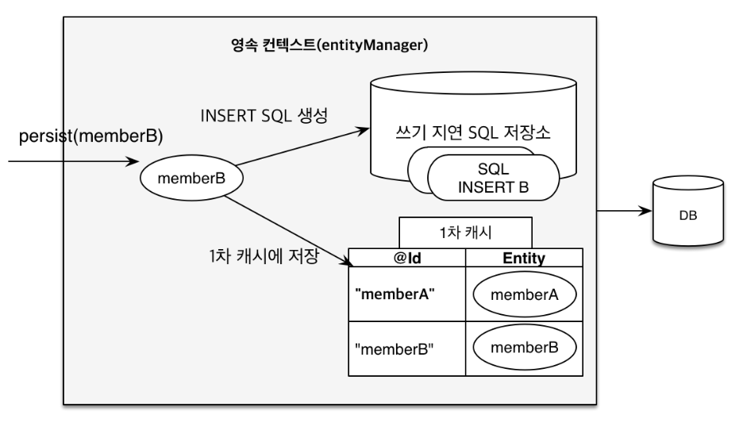

# 영속성 컨텍스트

## 엔티티의 생명주기

* **비영속 (new / transient)**

    영속성 컨텍스트와 전혀 관계가 없는 **새로운** 상태
  ```
  Member member = new Member();
  member.setId("member1");
  member.setUsername("회원1");
  ```
  
* **영속 (managed)**
    
    영속성 컨텍스트에 **관리**되는 상태 
    ```
    EntityManager em = emf.createEntityManager();
    em.getTransaction().begin();
    
    //객체를 저장한 상태(영속), 실제 DB에 저장 되는 것은 아님
    em.persist(member);
    ```

* **준영속 (detached) / 삭제 (removed)**
    ```
    //회원 엔티티를 영속성 컨텍스트에서 분리, (준영속 상태)
    em.detach(member);
    
    //객체를 삭제한 상태(삭제)
    em.remove(member);
    ```

## 1차 캐시
영속성 컨텍스트에는 1차 캐시를 가지고 있다. ( 한 트랜잭션 안에서만 유효함 )

```
Member member = new Member();
member.setId("member1");
member.setUserName("회원1");

//1차 캐시에 저장됨
em.persist(member);

//1차 캐시에서 조회
Member findMember = em.find(Member.class, member1); //(1차캐시에 있는 경우 캐시에서 가져옴)
Member findMember = em.find(Member.class, member2); //(1차캐시에 없는 경우 DB에서 가져오고 1차캐시에 저장 )
```


1차 캐시로 반복 가능한 읽기(Repeatable read) 등급의 트랜잭션 격리 수준을 데이터 베이스가 아닌 애플리케이션 차원에서 제공

<br>

## 트랜잭션을 지원하는 쓰기 지연

```
transaction.begin();

em.persist(memberA); //1차캐시 및 쓰기 지연 SQL 저장소에 Insert쿼리가 저장 됨
em.persist(memberB); //1차캐시 및 쓰기 지연 SQL 저장소에 Insert쿼리가 저장 됨

transaction.commit(); //트랜잭션 커밋 시점에 Insert쿼리 전달


//하이버네이트의 옵션을 통해 한번에 쿼리를 보내고 커밋함 일종의 버퍼링 기능
//hibernate.jdbc.batch_size
```



## 엔티티 수정 (변경 감지 Dirty Checking)

```
tx.begin();

Member member = em.find(Member.class, 150L);
member.setName("TESTTESTTEST"); //데이터 변경시 업데이트 처리 됨

//em.persist(member) 반영 할 필요 없음

tx.commit();
```

값만 바꿨는데 update 쿼리가 실행된다!!! 


