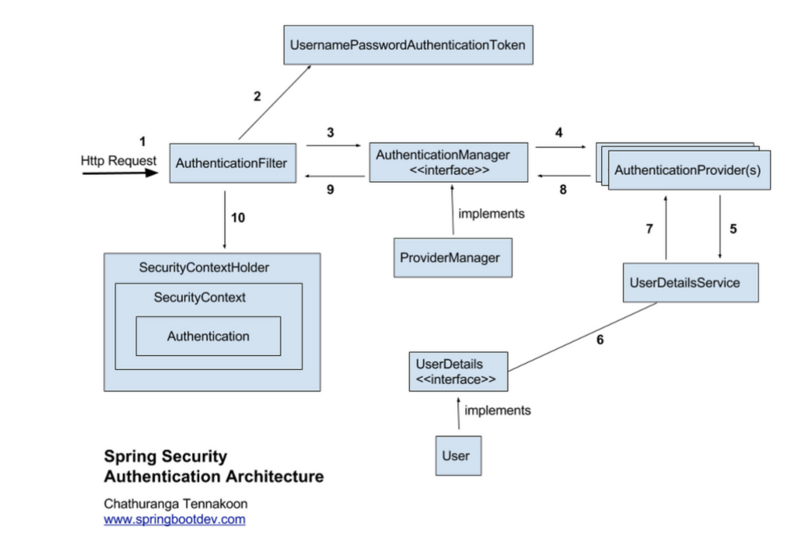

# 스프링 시큐리티의 동작과정

## 시큐리티란?

스프링 기반의 어플리케이션의 보안 (인증, 권한, 인가)를 담당하는 스프링 하위 프레임 워크

* 용어정리
  * 인증(Authenticate) : 유저가 누구인지 확인하는 절차
  * 인가(Authorization) : 인증된 사용자에 대해 권한을 확인하고 허락하는 것
  * 접근 주체(Principal) : 보호된 대상에 접근하는 유저
  * 비밀번호(Credential) : 대상에 접근하는 유저의 비밀번호

## 시큐리티의 특징과 구조

- 보안과 관련하여 체계적으로 많은 옵션을 제공하여 편리하게 사용할 수 있음
- Filter 기반으로 동작하여 MVC 와 분리하여 관리 및 동작
- 어노테이션을 통해 간단하게 설정할 수 있음
- 기본적으로 Session & Cookie 방식으로 인증
- 인증관리자(Authentication Manager)와 접근 결정 관리자(Access Decision Manager)을 통해 사용자의 리소스 접근을 관리
- 인증 관리자는 `UsernamePasswordAuthenticationFilter`, 접근관리자는 `FilterSecurityInterceptor`가 수행

## 동작원리

1. 사용자가 Form 을 통해 로그인 정보를 입력하고 인증요청을 보낸다
2. `AuthenticationFilter`(사용할 구현체 `UsernamePasswordAuthenticationFilter`)가 `HttpServletRequest`에서 사용자가 보낸 아이디와 패스워드를 인터셉트한다.  
   프론트 단에서 유효성 검사를 할 수도 있지만, 보안을 위해 다시 한 번 사용자가 보낸 아이디와 패스워드의 유효성 검사를 한다.  
   `HttpServletRequest`에서 꺼내온 사용자 아이디와 패스워드를 진짜 인증을 담당할 `AuthenticationManager` 인터페이스(구현체 - `ProviderManager`)에게 인증용 객체(`UsernamePasswordAuthenticationToken`)로 만들어줘서 위임한다.  
3. `AuthenticationFilter`에게 인증용 객체(`UsernamePasswordAuthenticationToken`)을 전달받는다.  
4. 실제 인증을 할 `AuthenticationProvider`에게 `Authentication` 객체를 다시 전달한다.  
5. DB에서 사용자 인증 정보를 가져올 `UserDetailsService` 객체에게 사용자 아이디를 넘겨주고 DB에서 인증에 사용할 사용자 정보(사용자 아이디, 암호화된 패스워드, 권한 등)를
   `UserDetails`(인증용 객체와 도메인 객체를 분리하지 않기 위해서 실제 사용되는 도메인 객체에 UserDetails를 상속하기도 함)라는 객체로 전달 받는다.
6. `AuthenticationProvider` 는 `UserDetails` 객체를 전달 받은 이후 **실제 사용자의 입력정보**와 **UserDetails객체**를 가지고 인증을 시도한다.
7. 인증이 완료되면 사용자 정보를 가진 Authentication 객체를 `SecurityContextHolder에` 담은 이후 `AuthenticationSuccessHandle` 를 실행한다. 
  * (실패시 AuthenticationFailureHandler를 실행)

 
